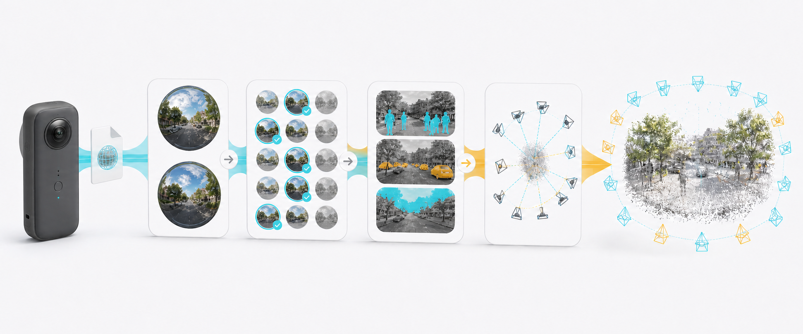
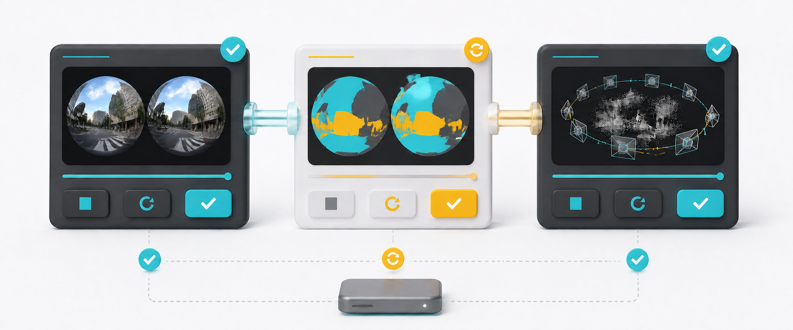

  
  <h1>SphereAlign</h1>
  
將全景相機原始檔，轉換成 Colmap 資料集

> [!WARNING]
> **目前還在開發階段。** 現階段僅支援 **Osmo 360**，其他格式檔案尚未驗證過。

## 將原始檔案變成 Colmap 資料集

過去要完成這件事，通常得在好幾個軟體和 CLI 工具之間來回切換，不只要手動整理檔案，還得記一堆指令、參數和執行順序，出錯時甚至得自己翻 log 找問題，整套流程既繁瑣又容易卡住。

這套工具把這些步驟整合到同一個介面裡。只要加入一段或多段在同一場景拍攝的全景影片，就能依序完成：

| 挑選畫面 | 遮掉干擾 | 對齊相機 |
| --- | --- | --- |
| 自動排除模糊影格，並從原始素材中挑選適合訓練的影格。 | 自動偵測並遮罩人物、腳踏車與常見車輛，減少移動物體對訓練結果的干擾。 | 將雙鏡頭作為 Rig 進行配對，並由 COLMAP 計算相機位置。 |

## 主要特點

* **一次處理多段全景影片**
  同一場景拍攝的多段雙魚眼影片，可以直接整合到同一個重建專案。

* **直接使用原始雙魚眼，跳過全景拼接與轉換**
  不必先把雙魚眼轉成全景、Cubemap 或其他投影格式，不只省下轉換時間與重採樣，也能避開全景拼接接縫造成的錯位、重影與細節損失。

* **自動挑出真正需要的影格**
  結合相機感應器、視角與畫面變化，自動排除不必要的影格，只處理適合重建的畫面。

* **利用相機感應器大幅加速對齊**
  跳過全景轉換，再利用相機感應器與畫面變化挑選影格、縮小配對範圍，在實測中，對齊時間由約 52 分鐘縮短至 28 分鐘，速度提升約 1.86 倍。

* **針對全景相機最佳化重建流程**
  將雙鏡頭視為固定 Rig，利用兩顆鏡頭之間的已知關係建立配對，讓 COLMAP 更有效率地推算相機位置。

* **自動排除人車等干擾**
  可遮罩人物、腳踏車、汽機車、公車、卡車與天空，減少動態物體對特徵匹配與重建結果的影響。

* **自動地面校正**
  利用相機感應器判斷重力方向，自動校正模型地面方向，省去每次都要手動旋轉、反覆對地面與水平線的麻煩。

## 從中斷的地方繼續

挑選畫面、遮罩和對齊都能分開執行、取消、重試或重跑。已經完成的結果會保留在專案裡；再次開啟任務時，程式會檢查並復用既有進度，而不用從頭開始。
